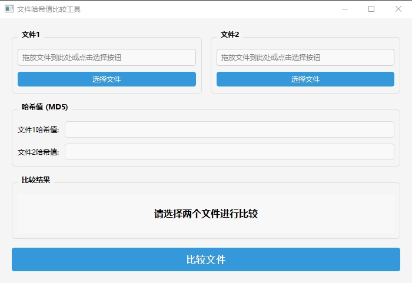

# 文件哈希值比较工具 (File Hash Comparison Tool)

一个简单易用的图形化工具，用于比较两个文件的MD5哈希值是否相同。


## 功能特点

- 简洁直观的图形用户界面
- 支持文件拖放功能，方便快速导入文件
- 即时计算并显示文件MD5哈希值
- 清晰的比较结果展示，使用颜色区分匹配状态
- 跨平台支持 (Windows, macOS, Linux)

## 使用场景

- 验证文件完整性
- 确认文件是否被修改
- 检查两个文件是否相同

## 如何使用

1. 通过"选择文件"按钮或直接拖放文件到输入框选择两个需要比较的文件
2. 点击"比较文件"按钮
3. 查看哈希值和比较结果
   - 绿色背景表示文件哈希值相同
   - 红色背景表示文件哈希值不同

## 安装与运行

### 方法一：直接运行

下载最新的可执行文件`is_different.ext`，直接运行即可。

### 方法二：从源代码运行
如果你想从源代码运行该工具，请按照以下步骤操作：

#### 依赖项

确保已安装Python 3.6+和所需依赖项：

```bash
pip install -r requirements.txt
```

### 运行程序

```bash
python is_different.py
```

#### 打包为可执行文件

可使用PyInstaller将程序打包为独立可执行文件：

```bash
pyinstaller --windowed --icon=pic/redGreen.ico --name "文件哈希比较工具" is_different.py
```

## 许可证

本项目采用MIT许可证。
